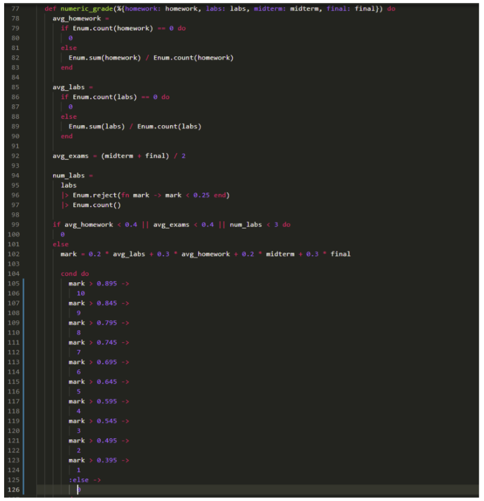
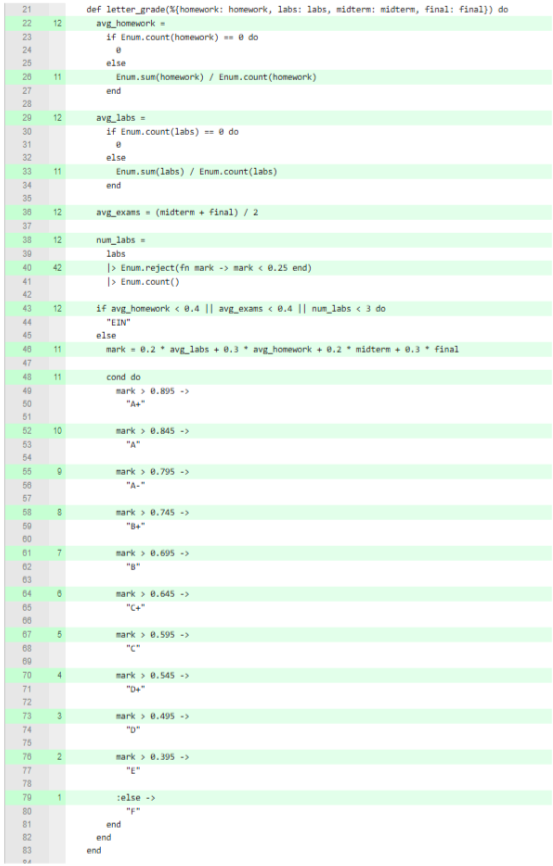

# Assignment 2 - SEG 3103 Playground

### Team

Name: Patrick Loranger, plora079@uottawa.ca 
Student Number: 300112374 

Name: Akram El-Gaouny, aelga098@uottawa.ca 
Student Number: 300109692

### Professor and Teaching Assistant

Professor: Andrew Forward, aforward@uottawa.ca 

Course: SEG 3103 
Date: Thursday June 10, 2021

### Link for deliverable

* [https://github.com/CodingPatrick/seg3103_playground](https://github.com/CodingPatrick/seg3103_playground)
* The pdf file of the screencapture is found in the submission folder in Brightspace

## Problem 1

### Question 1.1
#### Draw the simplified control flow graph corresponding to each of the methods percentage_grade, letter_grade, and numeric_grade.

Percentage grade:

Please Note That The diagram below is based on the Line Number of the picture above.
At a condition Right mean True and Left Means False.

Letter grade:

Please Note That The diagram below is based on the Line Number of the picture above.
At a condition Right mean True and Left Means False.

Numeric grade:

Please Note That The diagram below is based on the Line Number of the picture above.
At a condition Right mean True and Left Means False.

### Question 1.2
#### Provide a white box test design for 100% branch coverage of	the methods percentage_grade, letter_grade, and numeric_grade. Your test suite will be evaluated	on the	number of its	test cases (try to have the smallest possible number of test cases	that will allow	 100% branch	coverage). Use the following template for	 your test case	design:

| Notes for Reading the Table |
| --- |
| 
* The Conditional Branches are Labeled in the corresponding control-flow diagrams above (Ex: B1, D2, etc.) 
* For the conditions, I put the node where there’s a condition and what condition was evaluated. For example, (6-True) means that the condition in the if statement at line 6 of the code provided above was executed as true.
* Some conditions have multiple T/F, for example (45-True,True,True). What this means is that in line 45 there were three conditions and all of these conditions were true for a specific test |

| Test Case Number | Test Data | Expected Results | Conditions Covered | Branches Covered |
| --- | --- | --- | --- | --- |
| 1 | Homework: [] labs: [] midterm : 0.70 final: 0.70 | 35 | 6-True 13-True | B1, D1 |
| 2 | Homework: [1,1] labs: [1, 0.6, 1, 1] midterm : 0.70 final: 0.70 | 83 | 6-False 13-False | A1, C1 |

### Question 1.3
#### Provide an Implementation of your test suite using ExUnit

Implemented in grades/test/grades/calculator_test.exs

The following screenshot shows that all the tests have passed for the Grades.Calculator Module.

### Question 1.4:  
#### What is the degree of statement coverage obtained? If you weren’t able to achieve 100% coverage explain why. Please be sure to attach screenshots of your coverage results. Elixir’s coverage tool is primitive, as it only provides statement level accuracy. mix test --cover How might you address the limitations of a testing tool that only provides statement level coverage?

The degree of statement coverage that I obtained was 100% as I was able to cover all the statements in the three methods. I was able to achieve that since that I was aiming to achieve a 100% percent branch coverage which implies a 100% statement coverage.

To address the limitation of a tool that gives you only statement coverage, you really need to analyze the relationship between the type of coverage you want to achieve and the statement coverage that was given by the testing tool. For example, I designed my tests to achieve a 100% branch coverage, so I would expect the result of the statement coverage to be 100%. If that is not the case, then I know that I didn’t achieve a 100% branch coverage, so you essentially get hints from the statement coverage tool and you use it to relate to the type of coverage you got.

Screenshots for coverages:

Percentage grade:

Letter grade: 

Numeric grade:

## Problem 2

### Question 2.1
#### Extract a helper method avg to clean up the duplicate code

See changed made on commit: 

Screenshot of helper method:

### Question 2.2
#### Extract a helper method failed_to_participate? to clean up duplicate code

See changed made on commit: 

Screenshot of helper method:

### Question 2.3
#### Extract a helper method calculate_grade to clean up duplicate code

See changed made on commit: 

Screenshot of helper method:

### Question 2.4 
#### Provide at least 2 additional refactoring to the code. Your refactoring should not require additional testing, however if you encounter any bugs in the original code then please fix them separately (ensuring your tests continue to pass) before continuing to refactor.

See changed made on commit: 

Screenshot of helper method:

