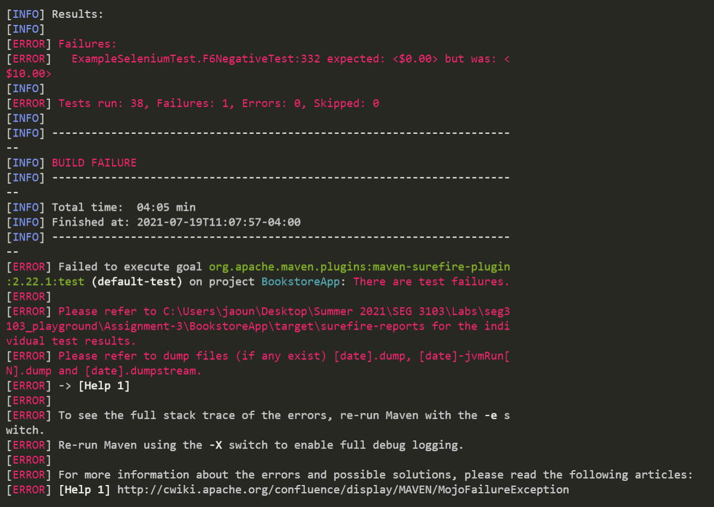

# Assignment 3 - SEG 3103 Playground

### Team

Name: Patrick Loranger, plora079@uottawa.ca<br>
Student Number: 300112374<br>

Name: Akram El-Gaouny, aelga098@uottawa.ca<br>
Student Number: 300109692

### Professor and Teaching Assistants

Professor: Andrew Forward, aforward@uottawa.ca<br>

Course: SEG 3103<br>
Date: Tuesday July 20, 2021

### Link for deliverable

* [https://github.com/CodingPatrick/seg3103_playground](https://github.com/CodingPatrick/seg3103_playground)

## Question 1 (20%)
### Give one positive and one negative test situation for each functional requirement in Section A.

The answer to this question can be found in: [a3_300112374_300109692.pdf](a3_300112374_300109692.pdf)

## Question 1 (30%)
### Derive test cases based on the use cases in section C. For each use case give
* A scenario graph
* A set of scenarios ensuring branch coverage of the scenario graph
* Abstract test cases corresponding to scenarios

The answer to this question can be found in: [a3_300112374_300109692.pdf](a3_300112374_300109692.pdf)

## Question 3 (50%)
### Provide a implementation of the test situations derived from the functional requirements in Question 1 and use case scenarios Question 2. Ensure you have traceability between your test implementation and the test situation. Give a brief explanation if you determine that a test situation cannot be implemented. 
### The function requirements should be written in Selenium using WebDriver, and the use case scenarios can be implemented using either Selenium directly, or with Cucumber (with StepDefs and Selenium invocation). 
### Attach screenshots of the result of running your tests to your report.

When all the tests are written and ready, we use these command lines to run them (or you can just run the 3rd one by itself):
```bash
mvn clean
```
```bash
mvn package -DskipTests
```
```bash
mvn clean test
```

Here is a screenshot of the results of running our tests:


As you can see there is:
* Tests run: 36
* Failures: 1
* Errors: 0
* Skipped: 0

This means that we have 35 tests that pass and only 1 that fails. The test that fails is F6NegativeTest, and it fails by design. Right now, the system charges 10$ shipping fee if there is nothing in the cart when you click "proceed to checkout". We made the assumption that it should not charge anything (0$) as the user is not ordering any books from the Library website. So in our F6NegativeTest, we assertEquals every value in the checkout page with 0$ even if we know it will fail. 

As professor Andrew Forward mentions in [Piazza @366:](https://piazza.com/class/knxg0zgsce5jp?cid=366) "Why do we test? Because software isn't perfect." We know in this case that the software for this library is not perfect because it should not charge any money to a user ordering nothing. This was a brief explanation on why we determined that this test cannot be implemented as a passing test, and must fail.

All of the written tests can be found in BookstoreApp -> src -> test -> java -> selenium -> ExampleSeleniumTest.java
