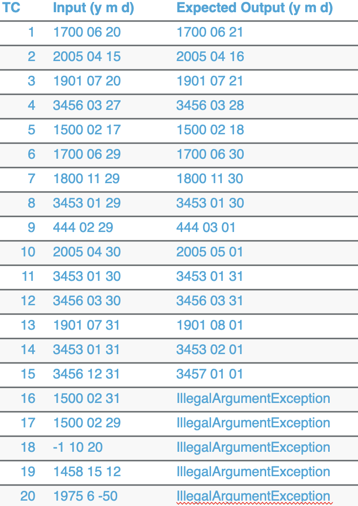

# SEG 3103 Playground - Lab 2

### Team

Name: Patrick Loranger, plora079@uottawa.ca<br>
Student Number: 300112374<br>

Name: Akram El-Gaouny, aelga098@uottawa.ca<br>
Student Number: 300109692

### Professor and Teaching Assistant

Professor: Andrew Forward, aforward@uottawa.ca<br>
TA: Henry Chen, zchen229@uottawa.ca<br>

Course: SEG 3103<br>
Date: Thursday May 27, 2021

### Link for deliverable

* [https://github.com/CodingPatrick/seg3103_playground](https://github.com/CodingPatrick/seg3103_playground)
* The pdf file of the screencapture is found in the submission folder in Brightspace

## Exercise 1

To run the application, we entered the following command line
```bash
java -jar  user-registration-app-0.1.0.jar
```
Then we visit the Local Host website.


| Test Case # | Test Case | Expected Result | Actual Result | Verdict (Pass, Fail, Inconclusive) |
| --- | --- | --- | --- | --- |
| 1 | UserName: A00000<br>FirstName: ""<br>LastName: ""<br>Age: 18<br>Email:+@-.AA<br>City: Halifax<br>PostalCode: A0A0A0 | registration request accepted | registration request accepted | Pass |
| 2 | UserName: zzzzzzzzzzzz<br>FirstName: A<br>LastName: zzzzzzzzzzzzzzzzz<br>Age: 64<br>Email:zzZZz.zz999@zzz.zzzz99999zzzzzzz.zzzzz zz9999zzzzz.zzzzzz<br>City: Toronto<br>PostalCode: Y9Z9Z9 | registration request accepted | registration request accepted | Pass |
| 3 | UserName: Aure723xxz<br>FirstName: "A "<br>LastName: “Bob The Great”<br>Age: 35<br>Email:boByy4534@some.where.com<br>City: Ottawa<br>PostalCode: A9A 9A9 | registration request accepted | registration request accepted | Pass |
| 4 | UserName: X56565z0<br>FirstName: Bond<br>LastName: James<br>Age: 60<br>Email:jb007@mi6.org<br>City: Montreal<br>PostalCode: Y0Z 0Z0 | registration request accepted | registration request accepted | Pass |
| 5 | UserName: ""<br>FirstName: ""<br>LastName: ""<br>Age: 18<br>Email: +@-.AA<br>City: Halifax<br>PostalCode: A0A0A0 | Err1 | Err1 and Err3 | Fail |
| 6 | UserName: z<br>FirstName: A<br>LastName: zzzzzzzzzzzzzzzzz<br>Age: 64<br>Email: zzZZz.zz999@zzz.zzzz99999zzzzzzz.zzzzz zz9999zzzzz.zzzzzz<br>City: Toronto<br>PostalCode: Y9Z9Z9 | Err3 | Err1 and Err3 | Fail |
| 7 | UserName: zzzzz<br>FirstName: “A ”<br>LastName: “Bob The Great”<br>Age: 35<br>Email: boByy4534@some.where.com<br>City: Ottawa<br>PostalCode: A9A 9A9 | Err3 | Err3 | Pass |
| 8 | UserName: @adr278a<br>FirstName: Bond<br>LastName: James<br>Age: 60<br>Email: jb007@mi6.org<br>City: Montreal<br>PostalCode: Y0Z 0Z0 | Err1 | Err1 | Pass |

### Screenshots for Exercise 1
You can find screenshots under assets. Either Input_TCX.PNG or Output_TCX.PNG, where X is the Test Case Number.

## Exercise 2

In Exercise 2, we were tasked with implementing some explicit test cases and some parameterized test cases based on the following screenshot:<br>


These tests can be found under ecs/test. The file with the explicit tests is DateTest.java. The file with the parameterized tests that run OK is DateNextDateOKTest.java. The file with the parameterized test that result in an exception is DateNextDateExceptionTest.java.
