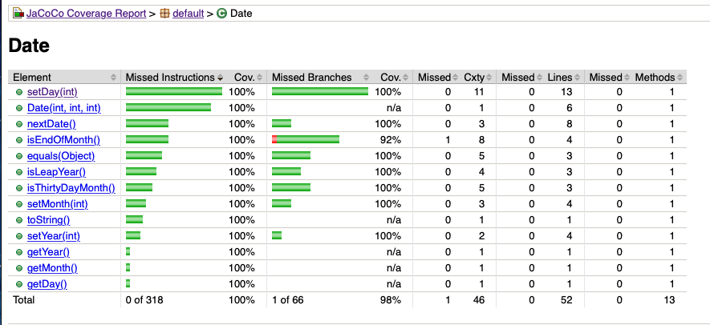
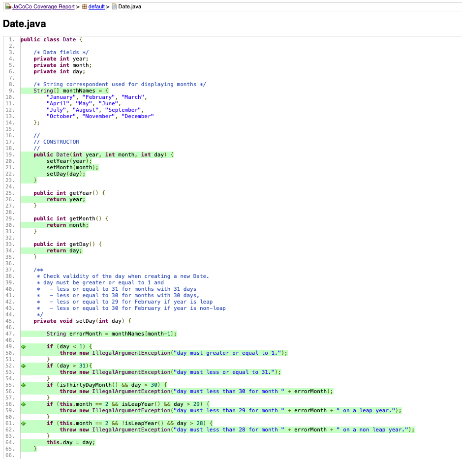
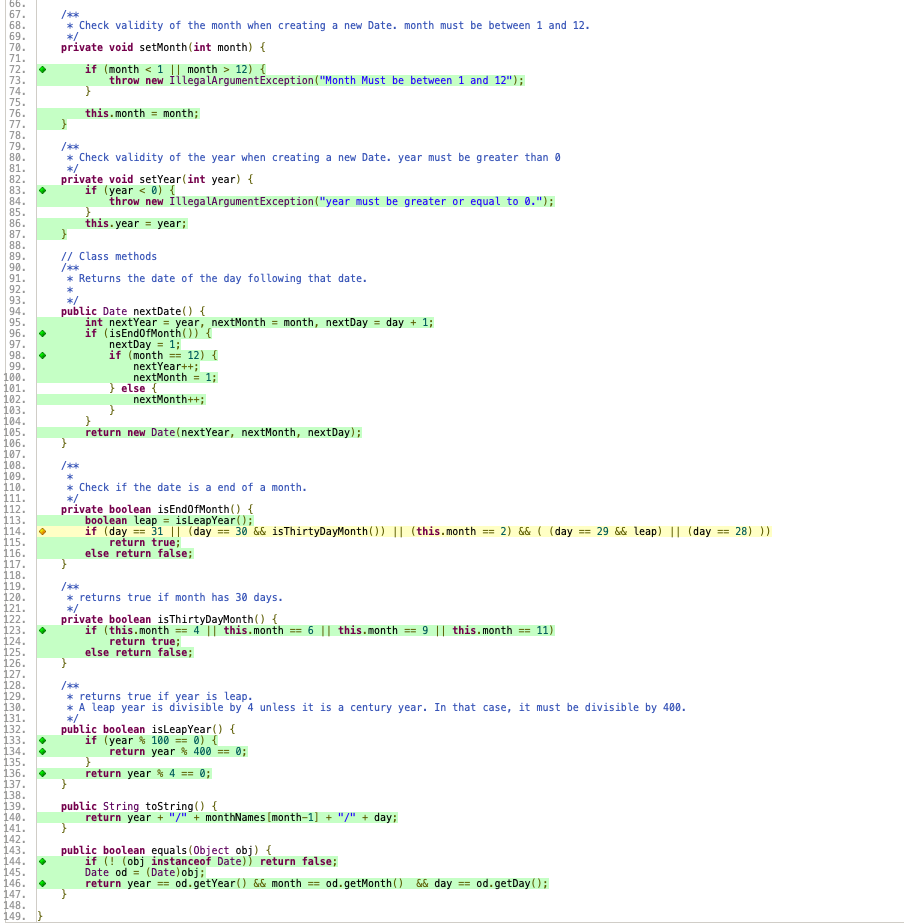

# Lab 03 - SEG 3103 Playground

### Team

Name: Patrick Loranger, plora079@uottawa.ca<br>
Student Number: 300112374<br>

Name: Akram El-Gaouny, aelga098@uottawa.ca<br>
Student Number: 300109692

### Professor and Teaching Assistant

Professor: Andrew Forward, aforward@uottawa.ca<br>
TA: Nazanin Bayati Chaleshtari, nbaya076@uottawa.ca<br>

Course: SEG 3103<br>
Date: Thursday June 3, 2021

### Link for deliverable

* [https://github.com/CodingPatrick/seg3103_playground](https://github.com/CodingPatrick/seg3103_playground)
* The pdf file of the screencapture is found in the submission folder in Brightspace

## Exercise 1 - Computation

First we compile run the tests in the computation folder using these command lines:
```bash
javac -encoding UTF-8 --source-path src -d dist src/*.java
```
```bash
javac -encoding UTF-8 --source-path test -d dist -cp dist:lib/junit-platform-console-standalone-1.7.1.jar test/*.java
```
```bash
java -javaagent:lib/jacocoagent.jar -jar lib/junit-platform-console-standalone-1.7.1.jar --class-path dist --scan-class-path
```
Here is a screenshot of the terminal after running the tests with the command lines:


Here is the text output of the screenshot above (for clarity purposes)
```bash
Thanks for using JUnit! Support its development at https://junit.org/sponsoring

╷
├─ JUnit Jupiter ✔
│  └─ ComputationTest ✔
│     ├─ divide() ✔
│     ├─ add() ✔
│     ├─ substract() ✔
│     ├─ multiply() ✔
│     ├─ catchesException() ✔
│     └─ justALoop() ✔
└─ JUnit Vintage ✔

Test run finished after 110 ms
[         3 containers found      ]
[         0 containers skipped    ]
[         3 containers started    ]
[         0 containers aborted    ]
[         3 containers successful ]
[         0 containers failed     ]
[         6 tests found           ]
[         0 tests skipped         ]
[         6 tests started         ]
[         0 tests aborted         ]
[         6 tests successful      ]
[         0 tests failed          ]
```

Then after seeing if the tests work, generate and open a report for Jacoco using these two command lines:
```bash
java -jar lib/jacococli.jar report jacoco.exec --classfiles dist --sourcefiles src --html report
```
```bash
open ./report/index.html
```
Here is proof that the report works and opens for computation:


## Exercise 1 - Date Coverage

First we opened Jacoco to see the initial coverage.

Then we created some new tests in our attempt to receive 100% coverage for the program.<br>
These tests can be found in the Date > Test > DateTest.java file.

We ran the same three command lines to compile and run the tests:
```bash
javac -encoding UTF-8 --source-path src -d dist src/*.java
```
```bash
javac -encoding UTF-8 --source-path test -d dist -cp dist:lib/junit-platform-console-standalone-1.7.1.jar test/*.java
```
```bash
java -javaagent:lib/jacocoagent.jar -jar lib/junit-platform-console-standalone-1.7.1.jar --class-path dist --scan-class-path
```
Here is a screenshot of the terminal after running the tests with the command lines:


Here is the text output of the screenshot above (for clarity purposes)
```bash
Thanks for using JUnit! Support its development at https://junit.org/sponsoring

╷
├─ JUnit Jupiter ✔
│  └─ DateTest ✔
│     ├─ nextDate_invalid_tc16() ✔
│     ├─ nextDate_invalid_tc17() ✔
│     ├─ nextDate_invalid_tc18() ✔
│     ├─ nextDate_invalid_tc19() ✔
│     ├─ nextDate_invalid_tc20() ✔
│     ├─ nextDate_invalid_tc21() ✔
│     ├─ nextDate_invalid_tc22() ✔
│     ├─ nextDate_invalid_tc23() ✔
│     ├─ equals_tc29() ✔
│     ├─ equals_tc30() ✔
│     ├─ equals_tc31() ✔
│     ├─ equals_tc32() ✔
│     ├─ isEndOfTheMonth_tc33() ✔
│     ├─ nextDate_tc01() ✔
│     ├─ nextDate_tc02() ✔
│     ├─ nextDate_tc03() ✔
│     ├─ nextDate_tc04() ✔
│     ├─ nextDate_tc05() ✔
│     ├─ nextDate_tc06() ✔
│     ├─ nextDate_tc07() ✔
│     ├─ nextDate_tc08() ✔
│     ├─ nextDate_tc09() ✔
│     ├─ nextDate_tc10() ✔
│     ├─ nextDate_tc11() ✔
│     ├─ nextDate_tc12() ✔
│     ├─ nextDate_tc13() ✔
│     ├─ nextDate_tc14() ✔
│     ├─ nextDate_tc15() ✔
│     ├─ toString_tc24() ✔
│     ├─ toString_tc25() ✔
│     ├─ toString_tc26() ✔
│     └─ toString_tc27() ✔
└─ JUnit Vintage ✔
   ├─ DateNextDateOkTest ✔
   │  ├─ [0] ✔
   │  │  └─ testNextDate[0] ✔
   │  ├─ [1] ✔
   │  │  └─ testNextDate[1] ✔
   │  ├─ [2] ✔
   │  │  └─ testNextDate[2] ✔
   │  ├─ [3] ✔
   │  │  └─ testNextDate[3] ✔
   │  ├─ [4] ✔
   │  │  └─ testNextDate[4] ✔
   │  ├─ [5] ✔
   │  │  └─ testNextDate[5] ✔
   │  ├─ [6] ✔
   │  │  └─ testNextDate[6] ✔
   │  ├─ [7] ✔
   │  │  └─ testNextDate[7] ✔
   │  ├─ [8] ✔
   │  │  └─ testNextDate[8] ✔
   │  ├─ [9] ✔
   │  │  └─ testNextDate[9] ✔
   │  ├─ [10] ✔
   │  │  └─ testNextDate[10] ✔
   │  ├─ [11] ✔
   │  │  └─ testNextDate[11] ✔
   │  ├─ [12] ✔
   │  │  └─ testNextDate[12] ✔
   │  ├─ [13] ✔
   │  │  └─ testNextDate[13] ✔
   │  └─ [14] ✔
   │     └─ testNextDate[14] ✔
   ├─ DateExceptionTest ✔
   │  ├─ [0] ✔
   │  │  └─ tests[0] ✔
   │  ├─ [1] ✔
   │  │  └─ tests[1] ✔
   │  ├─ [2] ✔
   │  │  └─ tests[2] ✔
   │  ├─ [3] ✔
   │  │  └─ tests[3] ✔
   │  └─ [4] ✔
   │     └─ tests[4] ✔
   └─ DateNextDateExceptionTest ✔
      ├─ [0] ✔
      │  └─ testNextDate[0] ✔
      ├─ [1] ✔
      │  └─ testNextDate[1] ✔
      ├─ [2] ✔
      │  └─ testNextDate[2] ✔
      ├─ [3] ✔
      │  └─ testNextDate[3] ✔
      └─ [4] ✔
         └─ testNextDate[4] ✔

Test run finished after 133 ms
[        31 containers found      ]
[         0 containers skipped    ]
[        31 containers started    ]
[         0 containers aborted    ]
[        31 containers successful ]
[         0 containers failed     ]
[        58 tests found           ]
[         0 tests skipped         ]
[        58 tests started         ]
[         0 tests aborted         ]
[        58 tests successful      ]
[         0 tests failed          ]
```

### Answering the CODE COVERAGE Question

Then after seeing if the tests work, generate and open a report for Jacoco using these two command lines:
```bash
java -jar lib/jacococli.jar report jacoco.exec --classfiles dist --sourcefiles src --html report
```
```bash
open ./report/index.html
```
After adding aditional tests to try to achieve 100% coverage, we believe it is possible because we have 100% coverage in our screenshots below.

We have 100% instruction coverage and 98% branch coverage. The only line that is missing a branch is:
```bash
if (day == 31 || (day == 30 && isThirtyDayMonth()) || (this.month == 2) && ( (day == 29 && leap) || (day == 28) ))
```
This line is missing 1 of 14 branches. It was refactored to reduce the number of branches from 16 to 14 to get more coverage.

Here is proof of our coverage when opening the report:




### Answering the REFACTORING Question

After refactoring our code our coverage improved. To refactor our code, as mentionned above, we changed one of the if statements to reduce the total number of branches from 16 to 14. We also refactored the setDay() function. It has many calls to monthNames[month-1]. We made a new String variable to reduce the amount of times the code has to compute monthNames[month-1] as seen in the screenshot below.


Also, for your reference, this was our Jacoco report before refactoring. As you can see in comparison to the screenshots above, there were a lot less branches covered. We managed to go from 99% instruction coverage and 89% branch coverage to 100% instruction coverage and 98% branch coverage.


