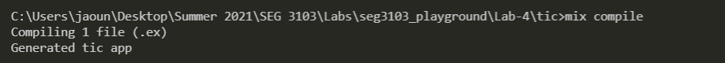
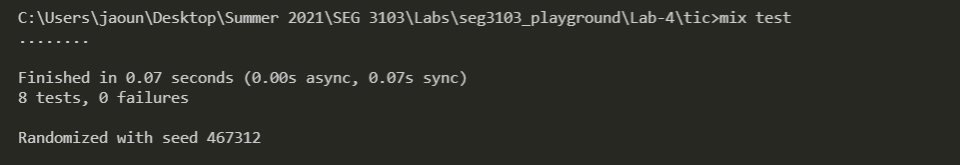
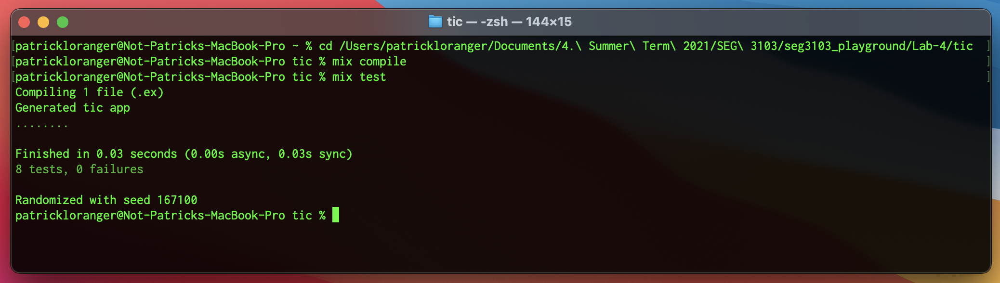
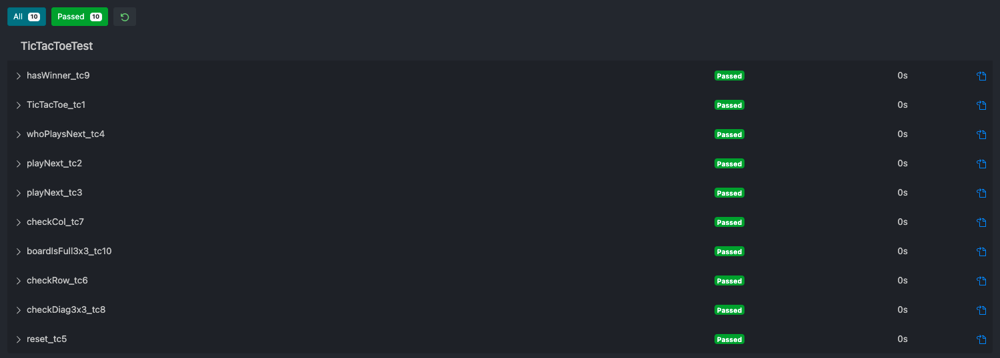

# Lab 04 - SEG 3103 Playground

### Team

Name: Patrick Loranger, plora079@uottawa.ca 
Student Number: 300112374 

Name: Akram El-Gaouny, aelga098@uottawa.ca 
Student Number: 300109692

### Professor and Teaching Assistant

Professor: Andrew Forward, aforward@uottawa.ca 
TA: Nazanin Bayati Chaleshtari, nbaya076@uottawa.ca 

Course: SEG 3103 
Date: Thursday June 10, 2021

### Link for deliverable

* [https://github.com/CodingPatrick/seg3103_playground](https://github.com/CodingPatrick/seg3103_playground)
* The pdf file of the screencapture is found in the submission folder in Brightspace

## Running Tic using Elixir - Akram El-Gaouny

The Following is a picture to prove that I can compile the Elixir application:

The Following is a picture to prove that I can run the Elixir application:

## Commits - Akram El-Gaouny

The table below contains links to all the commits I made. I tried to put picture but due to sizing issues the images were destorted.

| Commit Number | Implementation and Failing Test | Passing Test | Refactor|
| --------------| --------------------------------| -------------| --------|
| 1 | [1.1](https://github.com/CodingPatrick/seg3103_playground/commit/384d5fa345b695bc29eb87ce9ad2974d7e2f3883#diff-f25b0949c7a55ec53dfd929ed9675660921694b4f51711abf503ed73b98cc5f3) | [1.2](https://github.com/CodingPatrick/seg3103_playground/commit/7a71fd0581d0218bb66705bc0746880596b99f40#diff-f25b0949c7a55ec53dfd929ed9675660921694b4f51711abf503ed73b98cc5f3) | [1.3](https://github.com/CodingPatrick/seg3103_playground/commit/ff995275cd5b3efc7a0f706fbd3bcdc11f72d051#diff-f25b0949c7a55ec53dfd929ed9675660921694b4f51711abf503ed73b98cc5f3) | 
| 2 | [2.1](https://github.com/CodingPatrick/seg3103_playground/commit/fb360a2ffc60a28fd5a7622d679c812a2a73c37a#diff-f25b0949c7a55ec53dfd929ed9675660921694b4f51711abf503ed73b98cc5f3) | [2.2](https://github.com/CodingPatrick/seg3103_playground/commit/a6b794ec5ca6774748fcd25435eb2a26188a9652#diff-f25b0949c7a55ec53dfd929ed9675660921694b4f51711abf503ed73b98cc5f3) | [2.3](https://github.com/CodingPatrick/seg3103_playground/commit/7e32c495690cf713e3ececaf0971bc1a15f9e178#diff-f25b0949c7a55ec53dfd929ed9675660921694b4f51711abf503ed73b98cc5f3) | 
| 3 | [3.1](https://github.com/CodingPatrick/seg3103_playground/commit/bb82de9ca49a4c0d9d325de4ad797e31ca26e7ed#diff-f25b0949c7a55ec53dfd929ed9675660921694b4f51711abf503ed73b98cc5f3) | [3.2](https://github.com/CodingPatrick/seg3103_playground/commit/cfe91b49db9ac0727cbd1ec009e2695d0a3660e9#diff-f25b0949c7a55ec53dfd929ed9675660921694b4f51711abf503ed73b98cc5f3) | [3.3](https://github.com/CodingPatrick/seg3103_playground/commit/86fb6152cadd54a92b8c82d7bedfda05cdf1b26a#diff-f25b0949c7a55ec53dfd929ed9675660921694b4f51711abf503ed73b98cc5f3) | 
| 4 | [4.1](https://github.com/CodingPatrick/seg3103_playground/commit/270796b919d951534ec3f22ddf53b26ab2eb00fa#diff-f25b0949c7a55ec53dfd929ed9675660921694b4f51711abf503ed73b98cc5f3) | [4.2](https://github.com/CodingPatrick/seg3103_playground/commit/642606301b84172034c25878a2a4af3ffcba42c5#diff-f25b0949c7a55ec53dfd929ed9675660921694b4f51711abf503ed73b98cc5f3) | [4.3](https://github.com/CodingPatrick/seg3103_playground/commit/f32ddb857c41819127a0b5c6b8f4fce3289712cc#diff-f25b0949c7a55ec53dfd929ed9675660921694b4f51711abf503ed73b98cc5f3) | 
| 5 | [5.1](https://github.com/CodingPatrick/seg3103_playground/commit/327b717d6626d953fc609f02a20485d1a561e3f2#diff-f25b0949c7a55ec53dfd929ed9675660921694b4f51711abf503ed73b98cc5f3) | [5.2](https://github.com/CodingPatrick/seg3103_playground/commit/5871a39a69a44354a777ce709084afa7574a9877#diff-f25b0949c7a55ec53dfd929ed9675660921694b4f51711abf503ed73b98cc5f3) | [5.3](https://github.com/CodingPatrick/seg3103_playground/commit/5fad79b1c8c13cb386d17c1d26aa094ff718f809#diff-f25b0949c7a55ec53dfd929ed9675660921694b4f51711abf503ed73b98cc5f3) | 

Please note that at commit 2.2, I had to do a minor change in the code with the previous commit to fix a behaviour.

## Running Tic using Elixir - Patrick Loranger

The Following is a picture to prove that I can compile and run the Elixir application:

## Commits - Patrick Loranger

The table below contains links to all the commit I made. I tried to put picture but due to sizing issues the images were destorted.

| Commit Number | Implementation and Failing Test | Passing Test | Refactor|
| --------------| --------------------------------| -------------| --------|
| 1 | [1.1](https://github.com/CodingPatrick/seg3103_playground/commit/19e91e9fc99a13fc9ed41531a3bddef7f7e19535#diff-f25b0949c7a55ec53dfd929ed9675660921694b4f51711abf503ed73b98cc5f3) | [1.2](https://github.com/CodingPatrick/seg3103_playground/commit/cd8255c18d260a1f5abe46233b816210b68cd8af#diff-f25b0949c7a55ec53dfd929ed9675660921694b4f51711abf503ed73b98cc5f3) | [1.3](https://github.com/CodingPatrick/seg3103_playground/commit/6538dde02e79b9934946a7a667e0086c2a137f2e#diff-f25b0949c7a55ec53dfd929ed9675660921694b4f51711abf503ed73b98cc5f3) | 
| 2 | [2.1](https://github.com/CodingPatrick/seg3103_playground/commit/388e11d7d5020be56c8d5036f46275678936f2b6#diff-f25b0949c7a55ec53dfd929ed9675660921694b4f51711abf503ed73b98cc5f3) | [2.2](https://github.com/CodingPatrick/seg3103_playground/commit/7193a9f91a382ea74a6a00adda1f7c7304de2135#diff-f25b0949c7a55ec53dfd929ed9675660921694b4f51711abf503ed73b98cc5f3) | [2.3](https://github.com/CodingPatrick/seg3103_playground/commit/f9abe951728744dd274c80b5ae7356087da87995#diff-f25b0949c7a55ec53dfd929ed9675660921694b4f51711abf503ed73b98cc5f3) | 
| 3 | [3.1](https://github.com/CodingPatrick/seg3103_playground/commit/2bc0db02d1af1cf69d650b267ac43c549e3e0473#diff-f25b0949c7a55ec53dfd929ed9675660921694b4f51711abf503ed73b98cc5f3) | [3.2](https://github.com/CodingPatrick/seg3103_playground/commit/e31d0d303c03af2fc73c424e76285d47b4385d76#diff-f25b0949c7a55ec53dfd929ed9675660921694b4f51711abf503ed73b98cc5f3) | [3.3](https://github.com/CodingPatrick/seg3103_playground/commit/60f13269e97efbcbf6934bf4b6d5d920fdeca8c1#diff-f25b0949c7a55ec53dfd929ed9675660921694b4f51711abf503ed73b98cc5f3) | 
| 4 | [4.1](https://github.com/CodingPatrick/seg3103_playground/commit/fe2ac17886b0cc9f28a349af1ef8756437ff8718#diff-f25b0949c7a55ec53dfd929ed9675660921694b4f51711abf503ed73b98cc5f3) | [4.2](https://github.com/CodingPatrick/seg3103_playground/commit/9feb5e8b9a14daddded82b30f03057424ea5a441#diff-f25b0949c7a55ec53dfd929ed9675660921694b4f51711abf503ed73b98cc5f3) | [4.3](https://github.com/CodingPatrick/seg3103_playground/commit/a0f7e7e79fdb88a50f53475864fd23b966462f6d#diff-f25b0949c7a55ec53dfd929ed9675660921694b4f51711abf503ed73b98cc5f3) | 
| 5 | [5.1](https://github.com/CodingPatrick/seg3103_playground/commit/17f0b1813e8923c74380b88bb687daf0fc1b4249#diff-f25b0949c7a55ec53dfd929ed9675660921694b4f51711abf503ed73b98cc5f3) | [5.2](https://github.com/CodingPatrick/seg3103_playground/commit/d0b729724e55d58dba91b7e732466cee13eb7588#diff-f25b0949c7a55ec53dfd929ed9675660921694b4f51711abf503ed73b98cc5f3) | [5.3](https://github.com/CodingPatrick/seg3103_playground/commit/e9770422aad2627e831e375c9dcf53587f5e7b30#diff-f25b0949c7a55ec53dfd929ed9675660921694b4f51711abf503ed73b98cc5f3) | 

Please note that for commit 5.1 and 5.2, I had to do them twice. I realized my test was only passing because the code was broken (it was always true). The ones showed in the table are the correct commits.

## Final Testing

Here is proof that all of our tests pass for tic_java:

