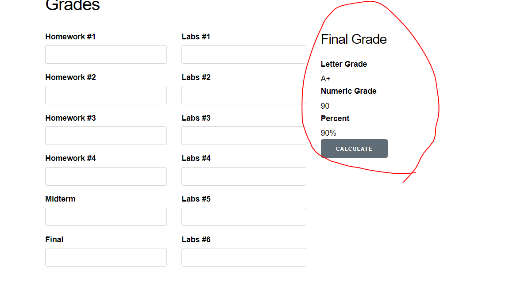

# Lab 05 - SEG 3103 Playground

### Team

Name: Patrick Loranger, plora079@uottawa.ca<br>
Student Number: 300112374<br>

Name: Akram El-Gaouny, aelga098@uottawa.ca<br>
Student Number: 300109692

### Professor and Teaching Assistant

Professor: Andrew Forward, aforward@uottawa.ca<br>
TA: Henry Chen, zchen229@uottawa.ca<br>

Course: SEG 3103<br>
Date: Friday July 2, 2021

### Link for deliverable

* [https://github.com/CodingPatrick/seg3103_playground](https://github.com/CodingPatrick/seg3103_playground)
* The pdf file of the screencapture is found in the submission folder in Brightspace

## Part 1: Stubbing Grades.Calculator

### Before Stubbing:


We can clearly see that there is no module called Grades.Calculator and thus the web application is failing. So, to avoid the faliure ( or make it fail in a way that ensures that the web application is not failing due to an error in the web app code) we need to stub Grades.Calculator.
### After Stubbing:
Here's the stubs that were created


Here's the effect of the stubs on the interface


Now, after stubbing we know that if there's a faliure in the application, it won't be from the web application but rather from another module. 

Since that we have tested the interface between the UI and the Grades.Calculator module, we can be sure that when we implement the actual logic in the Grades.Calculator module it won't fail due to an issue of communication (interface) between the UI and the module.

### Implementing The Actual Logic:

After implementing the actual logic from the A2 calculator module (As seen in this [commit](https://github.com/CodingPatrick/seg3103_playground/commit/66b560641375ab2db26701367a406c6014def3cd#diff-78d95c3f77e18667fedda5dfaad6f2fd7c0ee89048b3552bdeb43c7419f459a7)). The button and the logic don't work and I believe the reason it does not work is because of the addition operations. The interface (UI) calls the calculator functions with STRING parameters as opposed to int parameters therefore the A2 impleemntation is not compatiable with the web application. The error below is what I got when I implemented the logic of A2.


## Part 2: Mocks and Twitter

First, once I opened the Twitter, I made sure everything worked according to plan. 

I ran the command lines to compile the code: 
```bash
javac -encoding UTF-8 --source-path src -d dist src/*.java
```
```bash
javac -encoding UTF-8 --source-path test -d dist -cp dist:lib/easymock-4.3.jar:lib/junit-platform-console-standalone-1.7.1.jar test/*.java
```
Then, once the code was properly compile, I ran:
```bash
./bin/test
```
When I ran this command line, I got the following output:


Then, I implemented all the new Mocks in TwitterTest.java: See commit: [Implemented Mocks](https://github.com/CodingPatrick/seg3103_playground/commit/063bddd5820d192d26b4d36b3dc48f02df82df9e)

When I ran ./bin/test again, this was the results:


I realized that I need to fix the isMentionned(String name) function in Twitter.java: See commit: [Changed isMentionned()](https://github.com/CodingPatrick/seg3103_playground/commit/063bddd5820d192d26b4d36b3dc48f02df82df9e)

Once everything was completed, I ran ./bin/test one last time and everything works.
