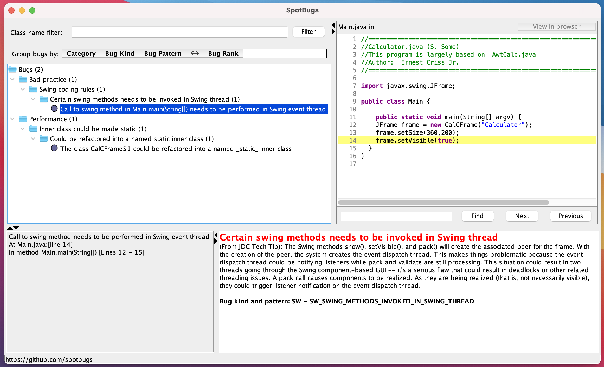
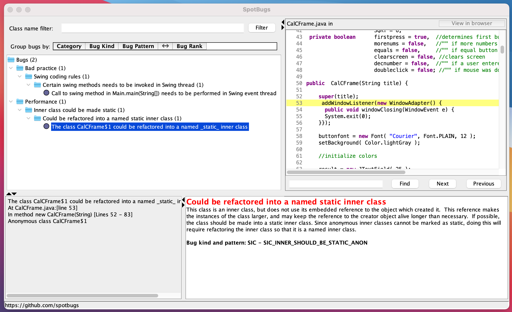
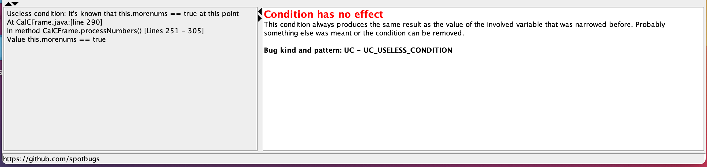
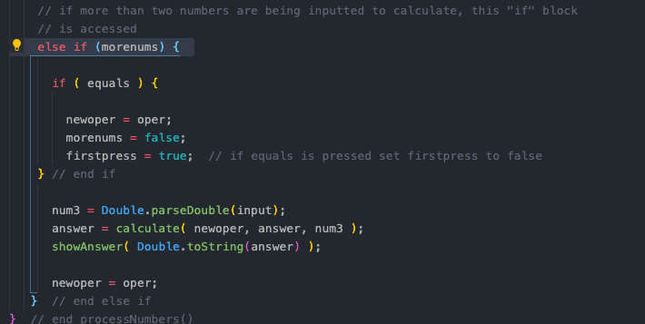
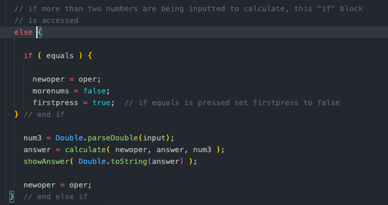

# Lab 07 - SEG 3103 Playground

### Team

Name: Patrick Loranger, plora079@uottawa.ca<br>
Student Number: 300112374<br>

Name: Akram El-Gaouny, aelga098@uottawa.ca<br>
Student Number: 300109692

### Professor and Teaching Assistant

Professor: Andrew Forward, aforward@uottawa.ca<br>
TA: Nazanin Bayati Chaleshtari, nbaya076@uottawa.ca<br>

Course: SEG 3103<br>
Date: Thursday July 22, 2021

## Proof of compiling the application

### Compiling the source Code
```code
javac -encoding UTF-8 --source-path src -d dist src/*.java
```


### Compiling the tests
```code
javac -encoding UTF-8 --source-path test -d dist -cp dist:lib/junit-platform-console-standalone-1.7.1.jar test/*.java
```


### Running the Application
```code
java -cp ./dist Main
```


### Running Spotbugs For Analysis
```code
java -jar ./lib/spotbugs/lib/spotbugs.jar
```


## Bug 1: 
For this bug, the original code uses == to compare strings and that is incorrect because String is a reference type not a primitive type.
#### Spot Bug Description

#### The Code Before Fixing The Issue

#### The Code After Fixing the Issue


## Bug 2: 
For this bug, what is happening is that the original code calls the function setVisible(). It will create a peer for the frame and with this creation, the system creates the event dispatch thread. This could notify listeners which could effect the code.
#### Spot Bug Description

#### Proposed Soloution
For this bug, we need to make sure that the function JFrame.setVisible is placed inside a Java Swing thread not just in main. In other words, the call to the swing method needs to be performd in a Swing event thread. 

## Bug 3: 
For this bug, what is happening is that the original code is not a static reference, and SpotBugs is saying that this is a prefered course of action.
#### Spot Bug Description

#### Proposed Soloution
For this bug, we would need to refactor the class CalCFrame$1 into a named static inner class. This would prevent this bug, and any further bugs.

## Bug 4: 
For this bug, there is a method that is never being used by the application and it is just wasting memory. So I deleted it.
#### Spot Bug Description

#### The Code Before Fixing The Issue

#### Proposed Soloution


## Bug 5: 
For this bug, there is unnecessary conversions occuring so I changed the code to make the conversion simpler and free of unnecessary steps. Please note that after I ran spotbug again, I noticed the same problem at different areas of the function so the same edit was done there (at: num2, num3).
#### Spot Bug Description

#### The Code Before Fixing The Issue

#### Proposed Soloution


## Bug 6: 
This over here is a warning that suggests the use of staic for ADD since that it is a final variable. Please note that this fix applies to bug 7,8,9,10,11 (ADD, SUB, MULT, DIVI, POW, SQRT) and I will not repeat images for those in the report to make the report more readable.
#### Spot Bug Description

#### The Code Before Fixing The Issue

#### Proposed Soloution


## Bug 12
The bug here is that there are branches that have the same operations in them and it is a warning to basically reduce branching and that will make the software much easier to test.
#### Spot Bug Description

#### The Code Before Fixing The Issue

#### Proposed Soloution


## Bug 13
The bug here was that no default statement was added in the code and it is recommended that every switch statement needs to have a default.
#### Spot Bug Description

#### The Code Before Fixing The Issue

#### Proposed Soloution


## Bug 14
In this bug, it is a very simple solution. There was initially an if(n) statement. There was also an else if(!n). This means that everything that does not qualify for the first if statement will be accepted by the else if. In other words, the code is useless and it is better to simply put an else.
#### Spot Bug Description

#### The Code Before Fixing The Issue

#### Proposed Soloution


## Spot Bugs Final
After a series of fixing bugs, this is the final output when running the Spot Bugs program. We only have 2 bugs left, the proposed solutions are given above.
