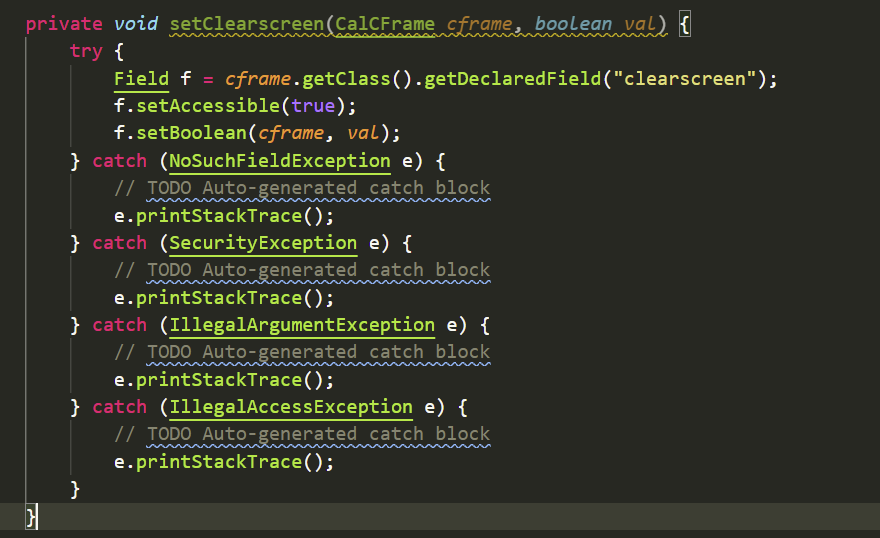

# Lab 07 - SEG 3103 Playground

### Team

Name: Patrick Loranger, plora079@uottawa.ca<br>
Student Number: 300112374<br>

Name: Akram El-Gaouny, aelga098@uottawa.ca<br>
Student Number: 300109692

### Professor and Teaching Assistant

Professor: Andrew Forward, aforward@uottawa.ca<br>
TA: Nazanin Bayati Chaleshtari, nbaya076@uottawa.ca<br>

Course: SEG 3103<br>
Date: Thursday July 22, 2021

## Proof of compiling the application

### Compiling the source Code
```code
javac -encoding UTF-8 --source-path src -d dist src/*.java
```


### Compiling the tests
```code
javac -encoding UTF-8 --source-path test -d dist -cp dist:lib/junit-platform-console-standalone-1.7.1.jar test/*.java
```


### Running the Application
```code
java -cp ./dist Main
```


### Running Spotbugs For Analysis
```code
java -jar ./lib/spotbugs/lib/spotbugs.jar
```


## Fixing/Suggesting Bug Fixes:

### Bug 1: 
<<<<<<< HEAD

For this bug, the original code uses == to compare strings and that is incorrect because String is a reference type not a primitive type

=======
For this bug, the original code uses == to compare strings and that is incorrect because String is a reference type not a primitive types
>>>>>>> 71829ce3824e33a74fdc3ef5e69f8a203404f134
##### Spot Bug Description

##### The Code Before Fixing The Issue

##### The Code After Fixing the Issue


### Bug 2: 
For this bug, what is happening is that the original code calls the function setVisible outside of a 
##### Spot Bug Description

##### The Code Before Fixing The Issue

##### Proposed Soloution
For this bug, we need to make sure that the function JFrame.setVisible is placed inside a Java Swing thread not just in main.

## Skipping Bug3 for now
### Bug 3: 
For this bug, what is happening is that the original code calls the function setVisible outside of a 
##### Spot Bug Description

##### The Code Before Fixing The Issue

##### Proposed Soloution
For this bug, we need to make sure that the function JFrame.setVisible is placed inside a Java Swing thread not just in main.

### Bug 4: 
For this bug, there is a method that is never being used by the application and it is just wasting memory. So I deleted it.
##### Spot Bug Description

##### The Code Before Fixing The Issue

##### Proposed Soloution


### Bug 5: 
For this bug, there is unnecessary conversions occuring so I changed the code to make the conversion simpler and free of unnecessary steps. Please note that after I ran spotbug again, I noticed the same problem at different areas of the function so the same edit was done there (at: num2, num3)
##### Spot Bug Description

##### The Code Before Fixing The Issue

##### Proposed Soloution


### Bug 6: 
This over here is a warning that suggests the use of staic for ADD since that it is a final variable. Please note that this fix applies to bug 7,8,9,10,11 (ADD, SUB, MULT, DIVI, POW, SQRT) and I will not repeat images for those in the report to make the report more readable.
##### Spot Bug Description

##### The Code Before Fixing The Issue

##### Proposed Soloution


### Bug 12
The bug here is that there are branches that have the same operations in them and it is a warning to basically reduce branching and that will make the software much easier to test
##### Spot Bug Description

##### The Code Before Fixing The Issue

##### Proposed Soloution


### Bug 13
The bug here was that no defualt statement was added in the code and it is recommended that every switch statement needs to have a default
##### Spot Bug Description

##### The Code Before Fixing The Issue

##### Proposed Soloution

