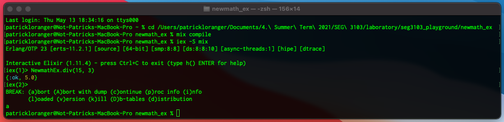

# Lab 01 - SEG 3103 Playground

Name: Patrick Loranger, plora079@uottawa.ca<br>
Student Number: 300112374<br>
Course: SEG 3103<br>
Date: Thursday May 20, 2021


Professor: Andrew Forward, aforward@uottawa.ca<br>
TA: Zahra Kakavand, zkaka044@uottawa.ca

## Link for deliverable

* [https://github.com/CodingPatrick/seg3103_playground](https://github.com/CodingPatrick/seg3103_playground)
* The pdf file of the screencapture is found in the submission folder in Brightspace

## Running newmath_java

### Running Java
On my mac, I am running Java 13.0.1
```bash
% java --version
java 13.0.1 2019-10-15
Java(TM) SE Runtime Environment (build 13.0.1+9)
Java HotSpot(TM) 64-Bit Server VM (build 13.0.1+9, mixed mode, sharing)
```

After I enter my folder, I compile the Java program in newmath_java with this command line: 
```bash
javac -encoding UTF-8 --source-path src -d dist src/*.java
```
I then run the program with this command line:
```bash
java -cp ./dist Main
```
This is the screenshot of what I receive on my terminal after the previous two command lines.


Here is the text output:
```bash
Newmath (type 'exit' to exit program)
Numerator: 15
Demoninator: 3
15 / 3 = 5
Numerator: exit
```

### Running JUnit

To compile the application to run JUnit, I run this command line:
```bash
javac -encoding UTF-8 --source-path test -d dist -cp dist:lib/junit-platform-console-standalone-1.7.1.jar test/*.java
```
Once it is compiled, I enter this command line to run the tests:
```bash
java -jar lib/junit-platform-console-standalone-1.7.1.jar --class-path dist --scan-class-path
```
This is the screenshot of what I receive on my terminal after the previous two command lines.


Here is the text output:
```bash
Thanks for using JUnit! Support its development at https://junit.org/sponsoring

╷
├─ JUnit Jupiter ✔
│  └─ NewmathTest ✔
│     ├─ div_ok() ✔
│     └─ div_by_zero() ✔
└─ JUnit Vintage ✔

Test run finished after 69 ms
[         3 containers found      ]
[         0 containers skipped    ]
[         3 containers started    ]
[         0 containers aborted    ]
[         3 containers successful ]
[         0 containers failed     ]
[         2 tests found           ]
[         0 tests skipped         ]
[         2 tests started         ]
[         0 tests aborted         ]
[         2 tests successful      ]
[         0 tests failed          ]
```

## Running newmath_ex

### Running Elixir

On my mac, I am running Elixir 11.4 with Erlang 23
```bash
% elixir --version
Erlang/OTP 23 [erts-11.2.1] [source] [64-bit] [smp:8:8] [ds:8:8:10] [async-threads:1] [hipe] [dtrace]

Elixir 1.11.4 (compiled with Erlang/OTP 23)
```

After I enter my folder, I compile the Elixir program in newmath_ex with this command line: 
```bash
mix compile
```
I then run the program with this command line:
```bash
iex -S mix
```
This is the screenshot of what I receive on my terminal after the previous two command lines.


Here is the text output:
```bash
iex(1)> NewmathEx.div(15, 3)
{:ok, 5.0}
iex(2)> 
BREAK: (a)bort (A)bort with dump (c)ontinue (p)roc info (i)nfo
       (l)oaded (v)ersion (k)ill (D)b-tables (d)istribution
```

### Running ExUnit

To run the ExUnit tests I run this command line:
```bash
mix test
```
This is the screenshot of what I receive on my terminal after the previous two command lines.


Here is the text output:
```bash
...

Finished in 0.05 seconds
1 doctest, 2 tests, 0 failures

Randomized with seed 898243
```
